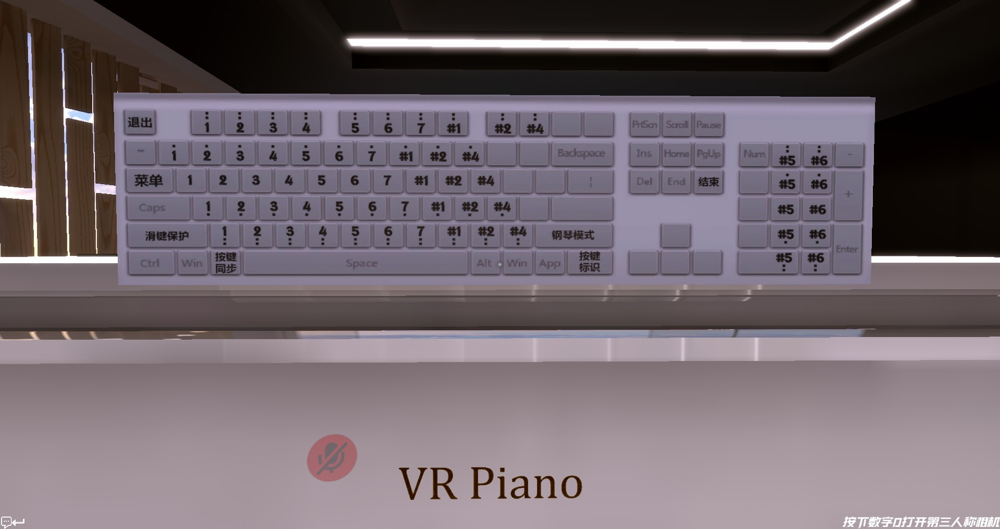
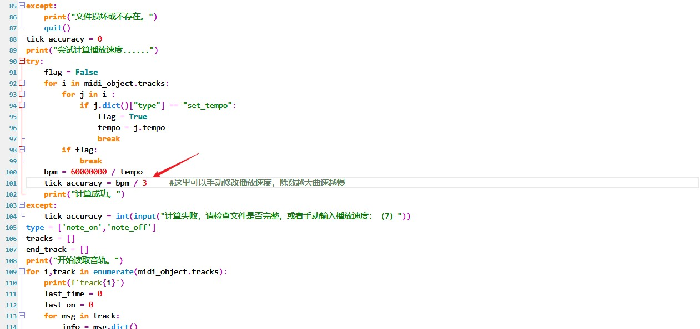

## 简介
根据midi文件演奏VRChat中文吧钢琴的脚本。由Python驱动

提示：所有键盘在动但是原神没反应的都是因为没有管理员权限，双击`run.bat`或者以管理员模式运行命令行可以解决问题！



## 使用方法

双击运行“run.bat”然后按照提示输入midi文件序号


### 运行环境

```
Windows
python 3.x
pywin32 （用于模拟键盘输入）
numpy
```

### 1. 安装Python

去Python官网下载然后安装

### 2.安装模块

安装并配置好python环境后使用`pip install -r requirements.txt`命令安装模块。

国内可以使用：

```
pip install -i https://pypi.tuna.tsinghua.edu.cn/simple -r requirements.txt
```

### 3.运行

双击`run.bat`

</details>

## 注意

任何双击bat文件一闪而过都是因为程序出错，请按以下步奏依次检查：

1. 检查是否安装了python 3.x并且设置了Path；
2. 检查是否安装好了依赖包；
3. 检查输入参数是否有误。


## 如何使用自己的曲谱？

https://www.midishow.com/
搜索喜欢的曲目下载，并将midi文件放入名为`songs`的文件夹里，有些midi文件的播放速度需要自己调整（见下图）。


